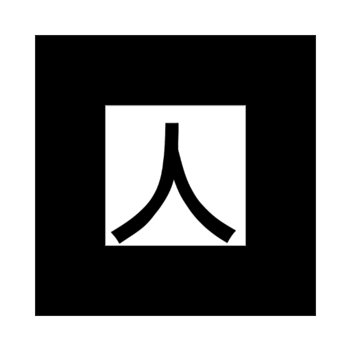

### 是否可以选择摄像头？
  
可以，WebRTC提供了API。  
[参考链接](https://developer.mozilla.org/zh-CN/docs/Web/API/MediaDevices/getUserMedia)  
该函数在本项目下的实现代码在：\three.js\src\threex\threex-artoolkitsource.js 中。  
作者的配置如下：
```javascript
facingMode: "environment" 
```
如果要强制使用后置摄像头，使用如下代码：
```javascript
facingMode: { exact: "environment" } 
```
但是强制使用后置可能影响PC端使用，可以使用优先后置摄像头：
```javascript
facingMode: { ideal: "environment" }
```

### 微信和QQ中是否可以实现？

Android的微信和QQ可以实现，ios的safari>=11可以，微信和QQ不行。  
微信和QQ默认使用前置摄像头，所以我测试时使用的是对称图片。  
测试网址：https://www.webapp.baoxizhao.com/three.js/examples/dev.html  
测试图片：   
不过该网址我不定时用来测试，所以偶尔会有问题。

### 如何替换模型文件？  
  
以dae文件为例：  
dev.html中：   
```javascript
	// var arWorldRoot = markerRoot
	var arWorldRoot = smoothedRoot
	var mesh = new THREE.AxisHelper()
	// markerRoot.add(mesh)
	arWorldRoot.add(mesh)
	// add a torus knot
	var geometry	= new THREE.CubeGeometry(1,1,1);
	var material	= new THREE.MeshNormalMaterial({
		transparent : true,
		opacity: 0.5,
		side: THREE.DoubleSide
	})
	var mesh	= new THREE.Mesh( geometry, material );
	mesh.position.y	= geometry.parameters.height/2
	// markerRoot.add( mesh );
	arWorldRoot.add(mesh)
	
	var geometry	= new THREE.TorusKnotGeometry(0.3,0.1,64,16);
	var material	= new THREE.MeshNormalMaterial(); 
	var mesh	= new THREE.Mesh( geometry, material );
	mesh.position.y	= 0.5
	// markerRoot.add( mesh );
	arWorldRoot.add( mesh );
	
	onRenderFcts.push(function(delta){
		mesh.rotation.x += delta * Math.PI
	})
```
作者的示例添加了一个立方体和TorusKnot，并给TorusKnot添加了一个简单的动画。  
如果要修改成添加dae文件，使用如下代码：   
```javascript
	// var arWorldRoot = markerRoot
	var arWorldRoot = smoothedRoot
	//加载Collada模型
	var loader = new THREE.ColladaLoader();
	//load(url,function)  url为模型路径，function(model)为模型加载完成后调用的函数，参数为加载完的模型model
	loader.load( 'animation/monster/monster.dae', function ( collada ) {
		dae = collada.scene; 
		dae.scale.x = dae.scale.y = dae.scale.z = 0.001; //调节模型显示大小
		arWorldRoot.add(dae);						   //将模型添加到group里
		onRenderFcts.push(function(){				   //添加旋转动画
		dae.rotation.z += 0.05
	})
	});
```
还要添加一些js库，将three.js中的修改成下面即可：
```javascript
<!-- three.js library -->
<script src='vendor/three.js/build/three.js'></script>
<script src='animation/Animation.js'></script>
<script src='animation/AnimationHandler.js'></script>
<script src='animation/KeyFrameAnimation.js'></script>
<script src='js/loaders/ColladaLoader.js'></script>
<script src='js/Detector.js'></script>
<script src='vendor/three.js/examples/js/libs/stats.min.js'></script>
```
animation/monster/monster.dae是我模型的相对位置，如果你的页面没有显示，请按F12进入开发者工具，在控制台看看是否有错误，有可能是文件路径不对。  
   
   
### 如何替换marker？  
  
dev.html中：   
```javascript
	var markerRoot = new THREE.Group
	scene.add(markerRoot)
	var markerControls = new THREEx.ArMarkerControls(arToolkitContext, markerRoot, {
		// type: 'barcode',
		// barcodeValue: 5,
		
		type : 'pattern',
		patternUrl : THREEx.ArToolkitContext.baseURL + 'examples/marker-training/examples/pattern-files/pattern-kanji.patt',
	})
```
可以看出 examples/marker-training/examples/pattern-files/pattern-hiro.patt 就是pattern文件的相对路径，对应的图片路径：AR.js-master\three.js\examples\marker-training\examples\inner-images\  
如下图所示：    
使用上面的图片作marker只需要在代码中替换对应的patt文件名即可，也可以使用自定义图片，需要在浏览器中打开http://localhost:8080/three.js/examples/marker-training/examples/generator.html，上传自己图片，生成对应的pat，放到对应目录下，然后修改patt文件名操作。
   
    
### 如何在本地运行该项目？

首先解释一下为什么直接打开html不行。WebRTC需要https，而直接本地打开是file协议，所以不行。  
下面介绍如何本地运行：  
需要一个本地服务器，如tomcat，作者推荐的是http-server(需要安装npm):  
```bash
npm install http-server -g
```
然后进入到项目根目录下（比如D:/AR.js-master）,启动hhtp-server：  
```bash
http-server
```
然后就可以在浏览器（推荐使用Chrome,支持的浏览器见项目README，根据了解目前支持Web RTC的:Windows:Chrome、Android：Chrome及QQx5内核的如微信qq打开、macOS及OS：safari 11）打开localhost:8080即可。  
作者给的示例html路径是localhost:8080/three.js/examples/mobile-performance.html  
localhost:8080/three.js/examples/dev.html与其大部分相同，后面不作说明的情况下，默认是指dev.html。

